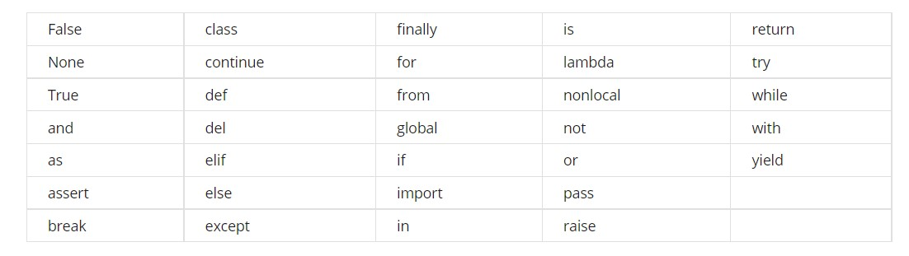

<h1>Python Notes</h1>

 Here you will see some important concepts of programming using python.

  
<h2>Functions and Keywords</h2>

Functions and keywords are the building blocks of a language’s syntax.
Functions are pieces of code that perform a unit of work.
Keywords are reserved words that are used to construct instructions. 

 Some of the keywords are: 

You can view some examples from here <a href="https://www.programiz.com/python-programming/keyword-list">examples</a>

<h2>Operations</h2>

 a + b = Adds a and b  
a - b = Subtracts b from a  
a * b = Multiplies a and b  
a / b = Divides a by b  
a ** b = Elevates a to the power of b. For non integer values of b, this becomes a root (i.e. a**(1/2) is the square root of a)  
a // b = The integer part of the integer division of a by b  
a % b = The remainder part of the integer division of a by b 

<h2>Data Types</h2>

<b>Note:</b> Do not try to add different types data types together otherwise you would get error

For example: print(3 + "5")

<h2>Variable</h2>

<b>Variables:</b> Names that we give to certain values in our programs.

<b>Assignment:</b> The process of storing a value inside a variable.

<b>Expression:</b> A combination of numbers, symbols, or other variables that produce a result when evaluated.

<h2>Functions</h2>

A function is defined with the def keyword, followed by the name we want to give our function. After the name, we have the parameters, also called arguments, for the function enclosed in parentheses. A function can have no parameters, or it can have multiple parameters. Parameters allow us to call a function and pass it data, with the data being available inside the function as variables with the same name as the parameters.

<h2>Comparison Operators</h2>

In Python, we can use comparison operators to compare values. When a comparison is made, Python returns a boolean result, or simply a True or False. 

<ul>
<li>To check if two values are the same, we can use the equality operator: == </li>
<li>To check if two values are not the same, we can use the not equals operator: != </li>

We can also check if values are greater than or lesser than each other using > and <.   <b>Note:</b> If you try to compare data types that aren’t compatible, like checking if a string is greater than an integer, Python will throw a TypeError.

The three main logical operators are <b>and</b>, <b>or</b>, and <b>not</b>. When using the <b>and</b> operator, both sides of the statement being evaluated must be true for the whole statement to be true. When using the <b>or</b> operator, if either side of the comparison is true, then the whole statement is true. Lastly, the <b>not</b> operator simply inverts the value of the statement immediately following it. So if a statement evaluates to True, and we put the not operator in front of it, it would become False.

<h2>If, Else and Elif Statement</h2>

Building off of the if and else blocks, which allow us to branch our code depending on the evaluation of one statement, the elif statement allows us even more comparisons to perform more complex branching. Very similar to the if statements, an elif statement starts with the elif keyword, followed by a comparison to be evaluated. This is followed by a colon, and then the code block on the next line, indented to the right. An elif statement must follow an if statement, and will only be evaluated if the if statement was evaluated as false. You can include multiple elif statements to build complex branching in your code to do all kinds of powerful things!

In Python, we branch our code using if, else and elif. This is the branching syntax:

if condition1: 

	if-block 
elif condition2: 
	elif-block 
else: 
	else-block

<b>Note:</b> The if-block will be executed if condition1 is True. The elif-block will be executed if condition1 is False and condition2 is True. The else block will be executed when all the specified conditions are false.

<h2>Loops</h2>

<h3>While loop</h3>

A while loop will continuously execute code depending on the value of a condition.

SYNTAX

while condition: 
    body

<h3>For loop</h3>

For loops allow you to iterate over a sequence of values.

SYNTAX

for variable in sequence:  
    body

The range() function:

range() generates a sequence of integer numbers. It can take one, two, or three parameters:
<ul>
<li>range(n): 0, 1, 2, ... n-1</li>

<li>range(x,y): x, x+1, x+2, ... y-1</li>

<li>range(p,q,r): p, p+r, p+2r, p+3r, ... q-1 (if it's a valid increment)</li>

</ul>
<h2>When to use which loop</h2>

Use <b>For Loops</b> when there is sequence of elements that you want to iterate

Use <b>While Loops</b> when you want to repeat an action until a condition changes.

<h3>Break & Continue</h3>

You can interrupt both while and for loops using the break keyword. We normally do this to interrupt a cycle due to a separate condition.

You can use the continue keyword to skip the current iteration and continue with the next one. This is typically used to jump ahead when some of the elements of the sequence aren’t relevant.

<h2>Strings</h2>
<h3>Lists</h3>

Lists in Python are defined using square brackets, with the elements stored in the list separated by commas: list = ["This", "is", "a", "list"]. You can use the len() function to return the number of elements in a list: len(list) would return 4. You can also use the in keyword to check if a list contains a certain element. If the element is present, it will return a True boolean. If the element is not found in the list, it will return False. For example, "This" in list would return True in our example. Similar to strings, lists can also use indexing to access specific elements in a list based on their position. You can access the first element in a list by doing list[0], which would allow you to access the string "This".

<b>Append:</b> You can add elements to the end of a list using the append method. You call this method on a list using dot notation, and pass in the element to be added as a parameter. For example, list.append("New data") would add the string "New data" to the end of the list called list.

<b>Insert:</b> If you want to add an element to a list in a specific position, you can use the method insert. The method takes two parameters: the first specifies the index in the list, and the second is the element to be added to the list. So list.insert(0, "New data") would add the string "New data" to the front of the list. 

<b>Remove:</b> You can remove elements from the list using the remove method. This method takes an element as a parameter, and removes the first occurrence of the element. If the element isn’t found in the list, you’ll get a ValueError error explaining that the element was not found in the list.

<b>Pop:</b> You can also remove elements from a list using the pop method. This method differs from the remove method in that it takes an index as a parameter, and returns the element that was removed. This can be useful if you don't know what the value is, but you know where it’s located. This can also be useful when you need to access the data and also want to remove it from the list.

<h3>Tuples</h3>

Lists are sequences of elements of any data type, and are mutable. The third sequence type is the tuple. Tuples are like lists, since they can contain elements of any data type. But unlike lists, tuples are immutable. They’re specified using parentheses instead of square brackets.Tuples can be useful when we need to ensure that an element is in a certain position and will not change. Since lists are mutable, the order of the elements can be changed on us. Since the order of the elements in a tuple can't be changed, the position of the element in a tuple can have meaning.

<h3> List Comprehension </h3>
<h4>Lists and Tuples Operations Cheat Sheet</h4>

 Lists and tuples are both sequences, so they share a number of sequence operations. But, because lists are mutable, there are also a number of methods specific just to lists. This cheat sheet gives you a run down of the common operations first, and the list-specific operations second.

Common sequence operations
len(sequence) - Returns the length of the sequence

for element in sequence - Iterates over each element in the sequence

if element in sequence - Checks whether the element is part of the sequence

sequence[i] - Accesses the element at index i of the sequence, starting at zero

sequence[i:j] - Accesses a slice starting at index i, ending at index j-1. If i is omitted, it's 0 by default. If j is omitted, it's len(sequence) by default.

for index, element in enumerate(sequence) - Iterates over both the indexes and the elements in the sequence at the same time 

 <b>List-specific operations and methods </b>

<ul>
<li> list[i] = x - Replaces the element at index i with x </li>

<li>list.append(x) - Inserts x at the end of the list</li>

<li>list.insert(i, x) - Inserts x at index i</li>

<li>list.pop(i) - Returns the element a index i, also removing it from the list. If i is omitted, the last element is returned and removed.</li>

<li>list.remove(x) - Removes the first occurrence of x in the list </li>

<li>list.sort() - Sorts the items in the list </li>

<li>list.reverse() - Reverses the order of items of the list </li>

<li>list.clear() - Removes all the items of the list </li>

<li>list.copy() - Creates a copy of the list </li>

<li>list.extend(other_list) - Appends all the elements of other_list at the end of list </li>
</ul> 

<h3>Dictionaries</h3>

Dictionaries are another data structure in Python. They’re similar to a list in that they can be used to organize data into collections. However, data in a dictionary isn't accessed based on its position. Data in a dictionary is organized into pairs of keys and values. You use the key to access the corresponding value. Where a list index is always a number, a dictionary key can be a different data type, like a string, integer, float, or even tuples. Dictionaries are mutable, meaning they can be modified by adding, removing, and replacing elements in a dictionary, similar to lists.

<h4>Dictionary Operations and Methods:</h4>

Operations

<ul>
<li>len(dictionary) - Returns the number of items in the dictionary</li>
<li>for key in dictionary - Iterates over each key in the dictionary</li>
<li>for key, value in dictionary.items() - Iterates over each key,value pair in the dictionary</li>
<li>if key in dictionary - Checks whether the key is in the dictionary</li>
<li>dictionary[key] - Accesses the item with key key of the dictionary</li>
<li>dictionary[key] = value - Sets the value associated with key</li>
<li>del dictionary[key] - Removes the item with key key from the dictionary</li>
</ul>

Methods

<ul>
<li>dict.get(key, default) - Returns the element corresponding to key, or default if it's not present</li>
<li>dict.keys() - Returns a sequence containing the keys in the dictionary</li>
<li>dict.values() - Returns a sequence containing the values in the dictionary</li>
<li>dict.update(other_dictionary) - Updates the dictionary with the items coming from the other dictionary. Existing entries will be replaced; new entries will be added.</li>
<li>dict.clear() - Removes all the items of the dictionary</li>
</ul>